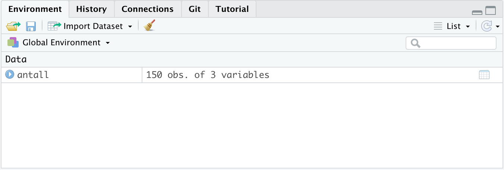

---
title: "Bio101_Introduksjon"
output: learnr::tutorial
runtime: shiny_prerendered

--- 


```{r setup, include=FALSE}
knitr::opts_chunk$set(echo = TRUE, message = FALSE)
#options(dplyr.summarise.inform = FALSE)

```


## Introduksjon

Dette er en introduksjon til praksis del XXX i Bio101 Organismebiologi 1 ved UiB.

I denne tutorial skal vi vise deg forsjkellige steg i data håntering, analyse og visualisering.
Vi skal forklare deg hvordan et dataset er bygget opp, hvordan man leser data inn i R, beregener gjennomsnitt og varians, tester forjskell mellom grupper og lager plot.
Deretter skal vi også diskutere hva som er viktig når du skriver en rapport og presenterer vitenskaplige resultater.

Vi skal jobbe med programvaren R, men ikke vær redd, vi skal forklare et steg om gangen og vi har også mer informasjon om R, hvordan man installerer R, og de første stegene i R som skal hjelpe deg.


## Preparasjon

Vi skal jobbe med programvaren R.
Hvis du aldri har brukt R før, finner du en introduksjon til R her: https://biostats.w.uib.no/up-in-the-r-2/introduction-to-r/

I R bruker vi forskjellige pakker som inneholder nyttige og nødvendige funksjoner.
Disse må vi først laste inn for at vi kan bruke funksjonene.
Hvis du aldri har brukt disse pakkene må du først installere dem.
Sånn installerer du en pakke:

```{r install-package, eval = FALSE, echo=TRUE}
install.packages("tidyverse")

```

Hvis dette er ny for deg, skjekk denne instruksjonen her: link

I denne tutorial skal vi bruke pakkene **learnr**, **tidyverse** og **broom** og vi laster disse in med funksjonen `library()`:

```{r load-libs, eval = TRUE, echo=TRUE}
library("learnr")
library("tidyverse")
library("broom")

```

## Organisajon av en data fil

Vi skal først snakke om organsasjon av data.

Når data blir samlet inn må disse digitaliseres i en tabell med kolonner og rad.
Vanligvis bruker man en programvare som Excel eller lignende for denne jobben.
En god metode er å lagre data i en format som .csv eller .txt, fordi disse krever ikke en spesifikk programvare til å åpne filene og derfor er dataene også tilgjengelig til andre.
Tilgjengelighet av data er et viktig grunnprinsipp av **Open and reproducible science**.

Det er lurt å tenke gjennom hvordan dataene skal organiseres.
Det mest vanlige er at toppen av kolonnene viser navn til variablene og hver enkel rad representerer en obsjervasjon.
En observasjon kan for eksempel være en måling for et individ, en observasjon av en type bakterie, eller en måling for et tre.

La oss se på et dataset som inneholder antall bakterier per ml for tre forskjellige vann i Bergen.
Den første rad viser navn til de tre kolonnene: **vann**, **bakterie** og **antall_per_ml**.
De neste radene inneholder data.
Det kan enten være tekst som de første to kolonnene eller tall.

```{r read_in_data_secretly, eval=TRUE, echo=FALSE}

antall <- read_delim(file = "data/Antall_bakterier.csv", delim = ",")
```

```{r display-data, eval=TRUE, echo=FALSE}

antall
```

## Hvordan laster jeg et dataset inn i R?

For å kunne jobbe med data i R, må vi først laste inn datasettet.
Dette gjør vi med å bruke vi funksjonen `read_delim()`.
Det første argument i denne funksjonen er `file`  og definerer hvor dataene er.
Det er ofte lurt å lage en mappe som heter **data** eller noe lignende hvor du lager dataene dine.
Det neste argumentet er `delim` og definerer hvilket tegn som ble brukt til å separerer dataene.
I dette tilfelle er det en komma.
Men det kan også være et annet tegn som semi-kolon (;) eller tab osw.

```{r read_in_data, eval=FALSE, echo=TRUE}

read_delim(file = "data/filename.csv", delim = ",")
```

La oss prøver med et riktig datasett som heter **Antall_bakterier.csv** og ligger i en mappe **data**.

```{r read_in_data2, eval=TRUE, echo=TRUE}
antall <- read_delim(file = "data/Antall_bakterier.csv", delim = ",")

```

Hvis vi nå ser i **Environment**, så vil vi finne et datasett som heter antall.

```{r environment, eval=TRUE, echo=FALSE}


```


## Deskriptiv statistikk

Et første steg er ofte å beskrive dataene eller oppsummere dataene.
Dette kalles for **deskriptiv statistikk**.

For dette bruker vi to forskjellige verdier: **gjennomsnitt** og **variabilitet**.


### Hva er gjennomsnitt?

**Gjennomsnitt** beskriver middelverdien av en variable altså den mest typiske verdien for en mengde med tall.
Gjennomsnitt beregnes med å summere alle verdiene av en variable og dele med antall verdier.

La oss si vi har mange fisker med forskjellig kroppslengde.
Nå deler vi disse forskjellige lengdene i lengde klasser og i et histogramm kan vi vise alle lengde klassene på x-aksen og antall, altså hvor mange ganger en hvis lengde forekommer på y-aksen.


```{r example_data, eval=TRUE, echo=FALSE}

dat <- tibble(dataset = c(rep("data1", 100), rep("data2", 100)),
              var = c(rnorm(n = 100, mean = 15, sd = 1), rnorm(n = 100, mean = 15, sd = 4)))

ggplot(dat, aes(x = var)) +
  geom_histogram() +
  geom_vline(xintercept = 15, colour = "red", linetype = "dashed") +
  labs(x = "Kroppslengde. i cm", y = "Antall verdier per størrelse") +
  theme_minimal()
  

```

Hvis vi vil beregne gjennomsnitt så teller vi alle lengdene tilsammen og deler med antall fisker.
I dette tilfelle er gjennomsnitt 15 og vises med den røde streken i figuren.


Formelen for gjennomsnitt er:
y = (x~1~ + x~2~ + x~3~ + ... + x~n~) / n

*x~1~* og *x~2~* osw er forskjellige tall fra en variable, for eksempel de forskjellige lengdene fra fiskene.
*x~n~* betyr at det kan være n antall størrelser.
Og *n* er antall fisker.

Hvis du vil vite mer om gjennomsnitt kan du se denne video:
https://biostats.w.uib.no/gjennomsnitt/


### Standard avvik og standard feil

Gjennomsnitt i seg selv er ikke nok til å beskrive et datasett.
Her er to datasett med kroppslengder av fisker som begge har gjennomsnitts lengden 15 cm.
Vi kan se veldig tydelig at fordelingen av dataene, altså antall lengde verdier i hver klasse er veldig forskjellig.
I det første datasettet har vi få lengde klasser med mange verdier (tett historamm), mens i det andre datasettet har vi mange lengder klasser med få verdier (brei histogramm).
Denne spredningen i data kalles standardavviket og gir verdienes gjennomsnittlige avstand fra gjennomsnittet.

```{r variability_data, eval=TRUE, echo=FALSE}

ggplot(dat, aes(x = var)) +
  geom_histogram() +
  geom_vline(xintercept = 15, colour = "red", linetype = "dashed") +
  labs(x = "Størrelse i cm", y = "Antall verdier per størrelse") +
  facet_wrap(~ dataset) +
  theme_minimal()
  

```


Standard avvik beregnes med å summere kvadratene av differanse mellom kroppslengden av hver fisk og gjennomsnitt og dele det med antall fisker og til slutt tar vi kvadratroten av alt.

Formelen for standard avvik er:
sd = sqrt([(x~1~ - y)^2^ + (x~2~ - y)^2^ + (x~3~ - y)^2^ + ... + (x~n~ - y)^2^] / n)

*x~1~* og *x~2~* osw er forskjellige tall fra en variable, for eksempel de forskjellige lengdene fra fiskene.
*x~n~* betyr at det kan være n antall størrelser.
*y* er gjennomsnitt og *n* er antall fisker.


- Forskjell mellom standard avvik og standard feil.


Hvis du vil vite mer om gjennomsnitt kan du se denne video:
https://biostats.w.uib.no/gjennomsnitt/

### Eksempel
La oss prøve nå:
hva betyr group_by og summarise
bruk round() for å ...
kable: lage fin tabell.

```{r tabel, eval=TRUE, echo=TRUE}

antall %>% 
  group_by(vann, bakterie) %>% 
  summarise(gjennomsnitt = mean(antall_per_ml),
            standardfeil = sd(antall_per_ml) / sqrt(n())) %>% 
   mutate(gjennomsnitt = round(gjennomsnitt, 2),
         standardfeil = round(standardfeil, 2)) %>% 
  knitr::kable()

```


## Hvordan lager jeg en boksplot?

- Hva er en boksplot, hva er på x og y akse
- Vi bruker ggplot for å lage figurer
- Første argumente er data, y er response, x er den forklarende variablen vi vil plotte og så må vi definere hva slags plot vi skal lage: ```geom_boxplot()```


```{r boxplot_1, eval=FALSE, echo=TRUE}
ggplot(data, aes(x = variable, y = response)) +
  geom_boxplot()

```


La oss prøve med et riktig eksempel:

```{r boxplot_2, eval=TRUE, echo=TRUE}
ggplot(antall, aes(x = vann, y = antall_per_ml)) +
  geom_boxplot()

```

La oss legge til noen ting for å lage plottet litt penere:

For å forandre tekste på aksen kan vi bruke ```labs()```

```facet_wrap()``` fordi vi har 2 bakterie typer. scales = ...

```theme_xxx()``` 


```{r boxplot_3, eval=TRUE, echo=TRUE}
ggplot(antall, aes(x = vann, y = antall_per_ml)) +
  geom_boxplot() +
  labs(x = NULL, y = "Antall bakterier per ml") +
  facet_wrap(~ bakterie, scales = "free_y") +
  theme_bw()

```

### Øvelse

Nå er de din tur!
Lag en boksplot

```{r boxplot_excercise, exercise=TRUE}
ggplot(..., aes(x = , y = )) +
  geom_boxplot()

```

## Hva er en vekstkurve?

- Hva er en vekstkurve, y og x akse


```{r vekstkurve_data, eval=TRUE, echo=FALSE}
vekst <- tibble(tid = c(0, 1, 2, 2.5, 3, 3.5, 4, 5, 6, 8, 10,  12, 16, 20, 24),
                celletall = c(1, 2, 3, 4, 5, 6, 8, 10, 12, 14, 16, 18, 20, 21, 21),
                standardfeil = c(0.1, 0.15, 0.4, 0.2, 1, 0.8, 2, 1, 0.5, 2, 2,  1.2, 2.7, 2.5, 1.5))

```

Hva slags data bruker vi?
Tid, en variable, som her er celletall og standard feil

```{r vekstkurve_data2, eval=TRUE, echo=TRUE}
vekst

```

Hvordan lager man en vekstkurve

```{r vekstkurve_1, eval=FALSE, echo=TRUE}
ggplot(data, aes(x = tid, y = variable)) +
  geom_point() +
  geom_line()

```


La oss prøve med et riktig eksempel:

```{r vekstkurve_2, eval=TRUE, echo=TRUE}
ggplot(vekst, aes(x = tid, y = celletall)) +
  geom_point() +
  geom_line() +
  labs(x = "Tid i dager", y = "Celletall") + 
  theme_bw()

```


Nå skal vi også legge til standardfeil for hver observasjon.
```{r vekstkurve_2_med_se, eval=TRUE, echo=TRUE}
ggplot(vekst, aes(x = tid, y = celletall, ymin = celletall - standardfeil, ymax = celletall + standardfeil)) +
  geom_point() +
  geom_line() +
  geom_errorbar() + 
  labs(x = "Tid i dager", y = "Celletall") + 
  theme_bw()

```


### Øvelse

Nå er de din tur!
Lag en vekstkurve med 

```{r vekstkurve_excercise, exercise=TRUE}
ggplot(, aes(x = , y = )) +
  

```

## Hvordan tester jeg forskjell mellom grupper?

Et ofte stillt spørsmål i økologi er om det er en forskjell mellom grupper.
For eksempel er biller fra skog A større en biller fra skog B.

Hvordan tester man dette:
Forklar veldig enkelt hva en ANOVA er

```{r}

antall %>% 
  nest(data = -bakterie) %>% 
  mutate(model = map(data, ~lm(antall_per_ml ~ vann, data = .)),
         result = map(model, tidy)) %>% 
  unnest(result)


```

Interpretasjon av resultatene...


## Noen ord om å lage en rapport

Rmarkdown er en praktisk metode å skrive en rapport.
Some explanations how it works.
