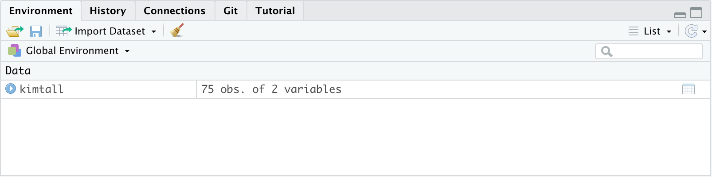

---
title: "Bio101_Introduksjon"
output: 
  learnr::tutorial:
    language: tutorial_no.json
runtime: shiny_prerendered
--- 


```{r setup, include=FALSE}
knitr::opts_chunk$set(echo = TRUE, message = FALSE)

# load learnr package
library("learnr")
library("tidyverse")

# laod datasets
kimtall <- read_delim(file = "data/Kimtall.csv", delim = ",")
vekst <- read_delim(file = "data/Vekst.csv", delim = ",")

# videos
embed_video <- function(src, type = "video/mp4", width = "320", height = "240",
                     attribute = "controls", placeholder = "") {
  if (knitr::is_html_output()) {
    sprintf("<video width='%3$s' height='%4$s' %5$s>
               <source src='%1$s' type='%2$s'>
            </video>", src, type, width, height, attribute)
  } else print(placeholder)
}
```


## Introduksjon

Dette er en introduksjon til praksis del i Bio101 Organismebiologi 1 ved UiB.

I denne tutorial skal vi vise deg forsjkellige steg i data håntering, analyse og visualisering.
Vi skal forklare deg hvordan et dataset er bygget opp, hvordan man leser data inn i R, beregner gjennomsnitt og varians, gjør en enkel test og lager et plot.
Deretter skal vi også diskutere hva som er viktig når du skriver en rapport og presenterer vitenskaplige resultater.

Vi skal jobbe med programvaren R, men ikke vær redd, vi skal forklare et steg om gangen.


## Organisajon av en data fil

Vi skal først forklare organisasjon av data i en fil.

Når data blir samlet inn må disse digitaliseres i en tabell med kolonner og rad.
Vanligvis bruker man en programvare som Excel eller lignende.
En god metode er å lagre data i en format som .csv eller .txt, fordi disse krever ikke en spesifikk programvare til å åpne filene og derfor er dataene også tilgjengelig til andre.
Tilgjengelighet av data er et viktig grunnprinsipp av **open and reproducible science**.

Det er lurt å tenke gjennom hvordan dataene skal organiseres.
Det mest vanlige er at kolonnene representerer forskjellige **variabler**, toppen av kolonnene viser navn til variablene og hver enkel rad representerer en observasjon.
En observasjon kan for eksempel være en måling for et individ, en observasjon av en type bakterie, eller en måling for et tre.

La oss se på et datasett som inneholder antall bakterier per ml for tre forskjellige vann i Bergen.
Den første rad viser navn til de to kolonnene: **vann** og **antall_per_ml**.
De neste radene inneholder data.
Data kan både være tekst som i den første kolonnen eller tall.
Variabler med tekst kalles for **kategorisk** mens variabler med tall heter **numerisk**.

Og sånn ser dette ut i R:

```{r show_read_in, eval=FALSE, echo=FALSE}

kimtall <- read_delim(file = "data/Kimtall.csv", delim = ",")
```

```{r display-data, eval=TRUE, echo=FALSE}

kimtall
```

## Hvordan laster jeg et dataset inn i R?

For å kunne jobbe med data i R, må vi først laste inn datasettet.
Dette gjør vi med å bruke funksjonen `read_delim()`.
Det første argument i denne funksjonen er `file`  og definerer hvor dataene er.
Det er lurt å lage en mappe som heter **data** hvor du lager dataene dine og beholder oversikten.
Det neste argumentet er `delim` og definerer hvilket tegn som ble brukt til å separerer dataene.
I dette tilfelle er det en komma.
Men det kan også være et annet tegn som semi-kolon `";"`, tab `" "`, eller noe annet.

```{r read_in_data, eval=FALSE, echo=TRUE}

data <- read_delim(file = "data/filename.csv", delim = ",")
```

Som du ser skriver vi også `data <-` som gir datasettet et nytt navn.
Det er viktig å gi datasettet et navn hvis vi vil bruke datasettet videre i R fordi det blir ikke gjort automatisk når et datasett blir lastet inn.

La oss nå prøve med et riktig datasett som heter **Kimtall.csv** og ligger i mappen **data**.
Vi gir dette datasettet et nytt navn **kimtall**.

```{r read_in_data2, eval=TRUE, echo=TRUE}
kimtall <- read_delim(file = "data/Kimtall.csv", delim = ",")

```

Hvis du nå ser på **Environment** tab (vanlighvis er den i det øvre høyere hjørnet i R Studio), så inneholder det nå et datasett som heter kimtall med 75 observasjoner (rad) og 2 variabler (kolonner).

```{r environment, eval=TRUE, echo=FALSE}


```


## Deskriptiv statistikk - gjennomsnitt

Et første steg er ofte å beskrive dataene eller oppsummere dataene.
Dette kalles for **deskriptiv statistikk**.

For dette bruker vi to forskjellige verdier: **gjennomsnitt** og **variabilitet**.


### Hva er gjennomsnitt?

**Gjennomsnitt** beskriver middelverdien av en variabel, altså den mest typiske verdien for en mengde med tall.
Gjennomsnitt beregnes med å summere alle verdiene av en variable og dele med antall verdier.

La oss si vi har en populasjon med fisker i det Lille Lungårsvannet og vi er interessert å finne ut gjennomsnittlig lengde på disse fiskene.
Vi drar på en fisketur, og fisker hundre fisker og måler kroppslengden på alle.
Nå deler vi disse forskjellige lengdene i lengde klasser og i et histogramm kan vi vise alle lengde klassene på x-aksen og antall, altså hvor mange ganger en hvis lengde forekommer på y-aksen (see figuren nedenfor).


```{r example_data, eval=TRUE, echo=FALSE}

dat <- tibble(dataset = c(rep("data1", 100), rep("data2", 100)),
              var = c(rnorm(n = 100, mean = 15, sd = 1), rnorm(n = 100, mean = 15, sd = 4)))

ggplot(dat, aes(x = var)) +
  geom_histogram() +
  geom_vline(xintercept = 15, colour = "red", linetype = "dashed") +
  labs(x = "Lengde i cm", y = "Antall verdier per lengde klasse") +
  theme_minimal()
  

```

For å beregne gjennomsnitt så teller vi alle lengdene sammen og deler med antall fisker.
I dette tilfelle er gjennomsnitt 15 cm og er markert med en røde strek i figuren.


Formelen for gjennomsnitt er:
y = (x~1~ + x~2~ + x~3~ + ... + x~n~) / n

*x~1~* og *x~2~* osw er forskjellige lengder til fiskene.
*x~n~* betyr at det kan være n antall fisker og størrelser.
Og *n* er antall fisker.

Hvis du vil vite mer om gjennomsnitt kan du se denne video:

`r embed_video(src = "http://bioceed.uib.no/dropfolder/bioSTATS/VideoSTATS/Gjennomsnitt1.mp4", type = "video/mp4", width = "320", height = "240", attribute = "controls", placeholder = "Sorry, your browser doesn't support embedded videos.")`

#### Gjennomsnitt i R

I R beregner vi gjennomsnitt med funksjonen `mean()`.

Hvis vi skal beregne gjennomsnitt for antall bakterier for kimtall datasettet bruker vi `mean()` funksjonen og definerer først datasett, altså **kimtall** og deretter fra hvilken variabel vi vil beregne gjennomsnitt.
Vi bruker dollar tegn `$` for å skille mellom datasett og variabelen.
I R ser dette sånn ut:

```{r mean1, eval=FALSE, echo=TRUE}
  
mean(datasett$variable)

```


I kimtall eksempelet skriver vi **kimtall**, `$` og  **antall_per_ml**.
Og du kan se at resultatet er et tall, nemmlig gjennomsnittet.

```{r mean2, eval=TRUE, echo=TRUE}
  
mean(kimtall$antall_per_ml)

```

#### Eksempel

Prøv nå selv å beregne gjennomsnitt for kimtall datasettet.
I R vinduet nedenfor kan du skrive koden som mangler (...) selv og deretter teste koden med å klikke på den blåe **Run Code** knappen i høyre hjørnet.
Du har så mange forsøk som du trenger.

```{r mean-excercise, exercise=TRUE}
  
mean(kimtall$...)

```


## Deskriptiv statistikk - variabilitet

### Standard avvik

Gjennomsnitt i seg selv er ikke nok til å beskrive en variabel.
Her er to datasett med kroppslengder av fisker som begge har en gjennomsnitt på 15 cm.
Vi kan se tydelig at fordelingen av dataene, altså antall lengde verdier i hver klasse er forskjellig.
I det første datasettet har vi få lengde klasser med mange verdier (tett historamm), mens i det andre datasettet har vi mange lengder klasser med få verdier (brei histogramm).
Denne spredningen i dataene kalles **standard avviket** og gir verdienes gjennomsnittlige avstand fra gjennomsnittet.

```{r variability-data, eval=TRUE, echo=FALSE}

ggplot(dat, aes(x = var)) +
  geom_histogram() +
  geom_vline(xintercept = 15, colour = "red", linetype = "dashed") +
  labs(x = "Lengde i cm", y = "Antall verdier per lengde klasse") +
  facet_wrap(~ dataset) +
  theme_minimal()
  

```


Standard avvik beregnes med å summere kvadratene av differanse mellom kroppslengden av hver fisk og gjennomsnitt og dele det med antall fisker og til slutt tar vi kvadratroten av alt.

Formelen for standard avvik er:
sd = sqrt([(x~1~ - y)^2^ + (x~2~ - y)^2^ + (x~3~ - y)^2^ + ... + (x~n~ - y)^2^] / n)

*x~1~* og *x~2~* osw er forskjellige tall fra en variable, for eksempel de forskjellige lengdene fra fiskene.
*x~n~* betyr at det kan være n antall lengder.
*y* er gjennomsnitt og *n* er antall fisker.

Hvis dette gikk litt for fort kan du se denne video som forklarer standard avvik i mer detalje:

`r embed_video(src = "http://bioceed.uib.no/dropfolder/bioSTATS/VideoSTATS/Variabilitet1.mp4", type = "video/mp4", width = "320", height = "240", attribute = "controls", placeholder = "Sorry, your browser doesn't support embedded videos.")`


Standard avvik beskriver spredningen for et gitt datasett, altså et begrenset tall av observasjoner, for eksempel for de 100 fiskene fra det Lille Lungårsvannet.
Vi kan bare målen lengden på et begrenset antall av fiskene i denne populasjonen, men egentlig er vi interessert i variabiliteten til hele populasjonen hvor vi har samlet disse 100 fiskene fra.
Altså fra hele fiske populasjonen i det Lille Lungårsvannet.

Hvordan kan vi generalisere standard avvik for hele populasjonen?


### Standard feil

Hvis vi hadde målt lengden på 100 tilfeldige fisker i det Lille Lungårsvannet flere ganger, hadde gjennomsnitt hvært litt forskjellig hver gang.
Dette kalles for prøvemiddel (*sampling distribution of the mean*).
Variansen av disse gjennomsnittene fra de forskjellige prøvene kan beregnes med standard avvik fra de forskjellige prøvene og dette kalles **standard feil av det estimerte gjennomsnittet**.
(This variance between the means of different samples can be estimated by the standard deviation of this sampling distribution and it is the standard error of the estimate of the mean.)

Dette er litt forvirrende!
Standard feil er en slags standard avvik i forskjellige verdier av prøvens gjennomsnitt. 
Kort sagt er standardfeilen i en statistikk ikke noe annet enn standardavviket i samplingsfordelingen.

Formelen for standard feil er:
se = sd / sqrt(n)

*sd* er populasjonsstandardavvik og *n* er antall observasjoner.

Hvis vi vil si noe om spredningen av en variabel kan vi bruke standard avvik.
Men hvis vi vil si noe om usikkerheten rundt en estimert gjennomsnitt, så bruker vi standard feil.


#### Standard avvik og feil i R

I R beregner man **standard avvik** med funksjonen `sd()`.

Hvis vi skal beregne standard avvik av bakterier for kimtall datasettet kan vi bruke `sd()` funksjonen. Vi definerer først datasett, altså **kimtall** og deretter for hvilken variabel vi vil beregne standard avvik.
I dette tilfelle er det **antall_per_ml**.
Vi bruker dollar tegn `$` mellom datasett og variable.

```{r sd, eval=TRUE, echo=TRUE}
  
sd(kimtall$antall_per_ml)

```

For å beregne **standard feil** trenger vi flere ting:

- standard avvik av antall bakterier, den har vi allerede beregnet lenger oppe.
- antall observasjoner *n*
- og funksjonen for kvadratroten

I R kan vi beregne antall observasjoner med funksjonen `length()` av en variabel i et datasett.
Og funksjonen for kvadratroten er `sqrt()`.

La oss sette alt sammen:

```{r se, eval=TRUE, echo=TRUE}

sd(kimtall$antall_per_ml) / sqrt(length(kimtall$antall_per_ml))

```

#### Eksempel

Prøv nå selv å beregne standard avvik for kimtall og standard feil fra :

```{r sd-excercise, exercise=TRUE}
  
sd(kimtall$...)

sd(kimtall$...) / sqrt(length(...))

```


## Deskriptiv statistikk - lage en tabell

La oss nå sette alt sammen og beregne gjennomsnitt og standard feil for kimtall i de tre forskjellige vann.
Vi skal lage en tabell som vi seinere kan bruke i en rapport, altså vi vil ha en ryddig tabell!

Vi må først si noen ord om `tidyverse`.
Lenger oppe brukte vi notasjon `kimtall$antall_per_ml` med `$`.
I mange tilfeller er dette greit, men det fins også en ny form for koding som ofte gjør ting enklere - `tidyverse`.

For dette må vi lære oss litt flere funksjoner:
I `tidyverse` er første argumentet alltid datasettet.
Neste argumentet er `%>% ` som heter *pipe* og det setter vi mellom alle funksjoner som vi skal bruke.

Med `summarise()` kan vi oppsummere et datasett, og vi kan oppsummere for en spesifikk gruppe med å bruke `group_by()`.

Vi skriver først datasett, pipe, `group_by()` med variablen vann for å indikere at vi vil beregne gjennomsnitt per vann.
Og til slutt `summarise()`.
I `summarise()` må vi gi et navn, altså gjennomsnitt og en funksjon altså `mean()` fra variabelen antall_per_ml.


```{r sumarise-mean, eval=TRUE, echo=TRUE}

kimtall %>% 
  group_by(vann) %>% 
  summarise(gjennomsnitt = mean(antall_per_ml))

```

Her får du en tabell med de tre vann og gjennomsnitt for hver vann.

Nå skal vi legge til standard feil i tabellen.
Vi bruker samme koden og legger til en linje i `summarise()`.
Vi må først bruke et komma, og deretter skriver vi neste funksjonen som skal gjøres i `summarise()`.
Det kan være en enkel formel eller som her noe mer komplisert.
Vi beregner standard avvik av kimtall, og deler med kvadratrot av antallet.
I `tidyverse` finnes det en egen funksjon for antall: `n()`


```{r sumarise-sd, eval=TRUE, echo=TRUE}

kimtall %>% 
  group_by(vann) %>% 
  summarise(gjennomsnitt = mean(antall_per_ml),
            standardfeil = sd(antall_per_ml) / sqrt(n()))

```


Nå har vi en tabell med gjennomsnitt og standard feil for de tre vann.


#### Eksempel

Prøv nå selv å beregne gjennomsnitt og standard feil for kimtall datasettet.

```{r sumarize-ex, exercise=TRUE}
  
kimtall %>% 
  group_by(...) %>% 
  summarise(gjennomsnitt = mean(...),
            standardfeil = sd(...) / sqrt(n()))

```


Denne tabellen kan lages litt penere, hvis vi runde av tallene.
Funksjonen `kabel()` lager en fin tabell og har et argumentet `digits =`, som bestemmer hvor mange tall etter komma du vil ha.
Her setter vi det lik 1.

I tillegg skal alle tabeller ha en tabelltekst som beskriver hva tabellen inneholder.
`kabel()` har et argument som heter `caption = ` hvor du kan legge til en tabelltekst.

```{r pretty-table, eval=TRUE, echo=TRUE}

kimtall %>% 
  group_by(vann) %>% 
  summarise(gjennomsnitt = mean(antall_per_ml),
            standardfeil = sd(antall_per_ml) / sqrt(n())) %>% 
  knitr::kable(digits = 1, caption = "Tabel 1: Her kan du beskrive hva denne tabellen inneholder.")

```

Er ikke dette en fin og ryddig tabell?


## Data visualisering med boksplott

Et boksplott er en kompakt, men effektiv måte å representere et datasett ved å bruke deskriptiv statistikk.
Boksen representerer det første og tredje kvartil og streken i midten er median.
Et boksplott har whiskers, og disse brukes til å representere minimum og maksimumsverdi.

Et boksplott brukes for å visualisere en numerisk variabel fra en eller flere grupper.
På y-aksen er det en numerisk variabel, mens på x-aksen er det en kategorisk variabel.

Hvis du vil vite mer om boksplott, for eksempel median, første og tredje kvartil, er det forklart i variabilitets video:

`r embed_video(src = "http://bioceed.uib.no/dropfolder/bioSTATS/VideoSTATS/Variabilitet1.mp4", type = "video/mp4", width = "320", height = "240", attribute = "controls", placeholder = "Sorry, your browser doesn't support embedded videos.")`

I R bruker vi `ggplot()` funksjonen for å visualisere data.
Første argumentet er data, deretter skriver vi `aes()` med `y = ` som definerer verdien på y-aksen, og `x =` verdien på x-aksen.
Neste funksjon er `geom_boxplot()` som definerer hvilken type plott vi skal lage.
Disse to funksjonene settes sammen med et pluss tegn `+`.

```{r boxplot-1, eval=FALSE, echo=TRUE}
ggplot(data, aes(x = x-akse-variabelen, y = y-akse-variabelen)) +
  geom_boxplot()

```


La oss prøve med kimtall datasettet.
Datasettet heter **kimtall**, på x-aksen vil vi ha variabelen **vann**, og på y-aksen **antall_per_ml** bakterier.

```{r boxplot-2, eval=TRUE, echo=TRUE}
ggplot(kimtall, aes(x = vann, y = antall_per_ml)) +
  geom_boxplot()

```

#### Eksempel

Prøv nå selv å lage en boksplott:

```{r boxplot-ex-simple, exercise=TRUE}
  
ggplot(kimtall, aes(x = ..., y = ...)) +
  geom_boxplot()

```


Med `ggplot()` har R verden din blitt kjempe stor og du har tusenvis av muligheter til å lage plott.
Høres det ikke flott ut?
La oss altså bruke noen muligheter og lage dette plottet litt penere!

For å forandre tekste på x- og y-aksen kan vi bruke `labs()` med argumentene `x = "Navn på x-aksen"` og `y = "Nav på y-aksen"`.
R bruker automatisk det navnet som er i datasettet, men ofte er det ikke veldig informativt.
På aksene i et plott vil vi gjerne ha et informativt navn av variabelen og enheten til en variabel.
I dette tilfelle er dette **Antall bakterier per ml**.
På x-aksen trenger vi egentlig ikke noe navn og bruker derfor `x = NULL`.

Vi kan bruke `theme_minimal()` for å forandre utseende til plottet.
Det fins mange forskjellige `theme_...()` og du kan finne ut selv hvilken du liker best.

Kanskje du vil lage teksten og tallene på aksene litt større.
Det er lurt å lage teksten i et plot stort nok at alle kan lese tall og navn på aksene.
Disse kan bli litt liten hvis du viser plottet i en presentasjon på en skjerm.
For dette legger vi til funksjonen `theme()` med argumentet `text = element_text()`.
Her kan vi definere størrelsen av teksten med `size = `.


```{r boxplot-3, eval=TRUE, echo=TRUE}
ggplot(kimtall, aes(x = vann, y = antall_per_ml)) +
  geom_boxplot() +
  labs(x = NULL, y = "Antall bakterier per ml") +
  theme_minimal() +
  theme(text = element_text(size = 15))

```

Ser ikke dette mye bedre ut?


### Eksempel

Nå er de din tur!
Lag en boksplott som viser kimtall for hvert vann.

```{r boxplot-excercise-vann, exercise=TRUE}
ggplot(kimtall, aes(x = ..., y = ...)) +
  geom_boxplot()

```

Prøv nå de forskjellige funksjonene `labs()`, `theme_minimal()`, `theme_bw()`, `theme_classic()` og `theme(text = element_text())` for å forbedre utseende på plottet.

```{r boxplot-excercise-pretty, exercise=TRUE}
ggplot(kimtall, aes(x = , y = )) +
  geom_boxplot() +
  labs()

```


## Hva er en vekstkurve?

En vekstkurve viser en utvikling av en populasjon over tid.
Vi kan visualisere vekst med tid på x-aksen og antall av for eksempel antall celler på y-aksen.

La oss se på vekst datasett.
Vi leser inn datasette med `read_delim()`.
Det har tre kolonner: **tid**, **celletall** og **standard feil**.

```{r read-in-vekst, eval=TRUE, echo=TRUE}
vekst <- read_delim(file = "data/Vekst.csv", delim = ",")

vekst
```

Her er vekstkurven fra dette datasettet.
Dette er ikke en boksplott fordi vi har to numeriske variabler: tid og antall celler.
Vi må bruke en annen form for visualisering, og her ser du vi bruker punkter og en linje.
I R må vi derfor bruke `geom_point()` som lager et punkt for hver datapunkt og `geom_line()` som lager linjen mellom punktene.

```{r vekstkurve, eval=TRUE, echo=FALSE}
ggplot(vekst, aes(x = tid, y = celletall)) +
  geom_point() +
  geom_line() +
  labs(x = "Tid i dager", y = "Antall celler") +
  theme_minimal()
  
```


### Eksempel

Prøv nå selv å lage denne vekstkurven.
Vi vil ha tid på x-aksen og antall celler på y-aksen.

Hvis du ønsker kan du også forandre på navn på aksene og størrelsen av teksten osw.

```{r vekstkurve-excercise, exercise=TRUE}
ggplot(vekst, aes(x = ..., y = ...)) +
  geom_point() +
  geom_line()
  
```


Nå skal vi legge til standard feil for hver observasjon i plottet.
For dette må vi først definere hva den minste og største verdien til standard feil er.
I `ggplot()` bruker vi `ymin` og `ymax`.
Og i tillegge må vi bruke funksjonen `geom_errorbar()` for å plottet standard feil.

```{r vekstkurve2-se, eval=TRUE, echo=TRUE}
ggplot(vekst, aes(x = tid, y = celletall, 
                  ymin = celletall - standardfeil, 
                  ymax = celletall + standardfeil)) +
  geom_point() +
  geom_line() +
  geom_errorbar() + 
  labs(x = "Tid i dager", y = "Antall celler") + 
  theme_bw()

```


### Eksempel

Nå er de din tur!
Lag en vekstkurve med standarfeil.

```{r vekstkurve-excercise2, exercise=TRUE}
ggplot(vekst, aes(x = , y = , ymin = , ymax = )) +
  geom_point() +
  ... +
  theme_minimal()
  
```


## Interpretasjon av resultater

Et ofte stilt spørsmål i økologi er om det er en forskjell mellom grupper.
Vi kan for eksempel spørre om antall bakterier i de tre vann er forskjellige.
La oss se på boksplottet igjen som vi laget.

```{r forskjell, eval=TRUE, echo=FALSE}
ggplot(kimtall, aes(x = vann, y = antall_per_ml)) +
  geom_boxplot() +
  labs(x = NULL, y = "Antall bakterier per ml") +
  theme_minimal() +
  theme(text = element_text(size = 15))

```

Boksplott er nyttig fordi de inneholder enkel statistikk.
Vi kan sammenligne streken i de 3 boksplott som viser median og ser tydelig at median er veldig forskjellig i de 3 vann.
Vi kan si at de tre vann har dermed forskjellige gjennomsnittlig antall bakterier.

Vi kan også sammenligne boksene og sjekke om de overlapper.
Boksene til Andedam og Lille Lungårsvannet overlapper litt, men ikke Puddefjorden.
Vi kan si at antall bakterier i Puddefjorden er mindre en i Andedam og Lille Lungårsvannet.

Størrelsen på boksene sier oss også noe om variabilitet.
I Puddefjorden er spredningen av data mye mindre en de andre to vann.

Vi kan ikke si noe om sansynlighet og hvor sikkre vi er på disse resultatene.
For dette trenger vi statistiske tester.
Men for denne øvelsen er vi fornøyd med disse resultatene.

