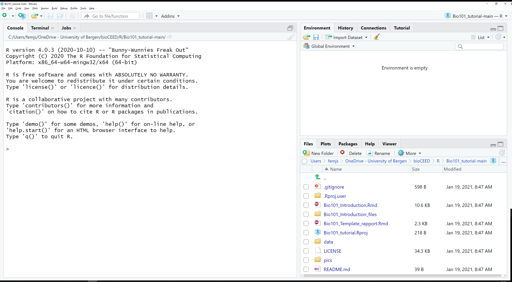
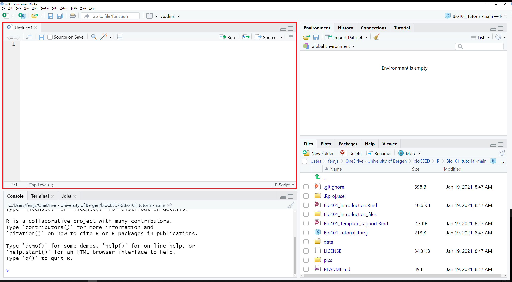
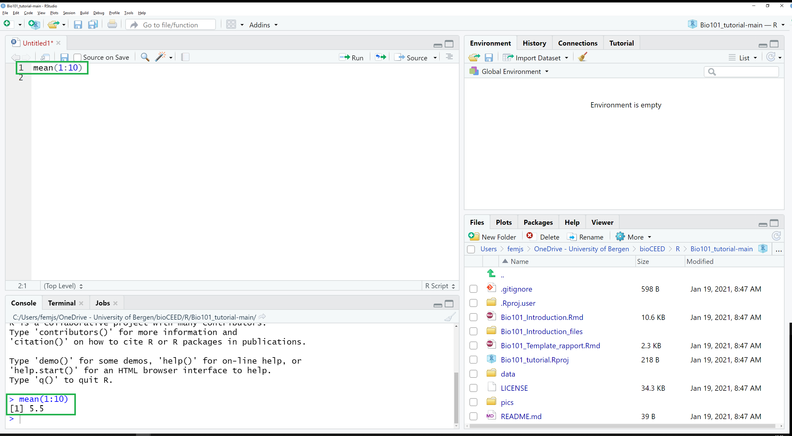
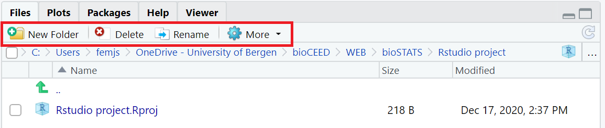
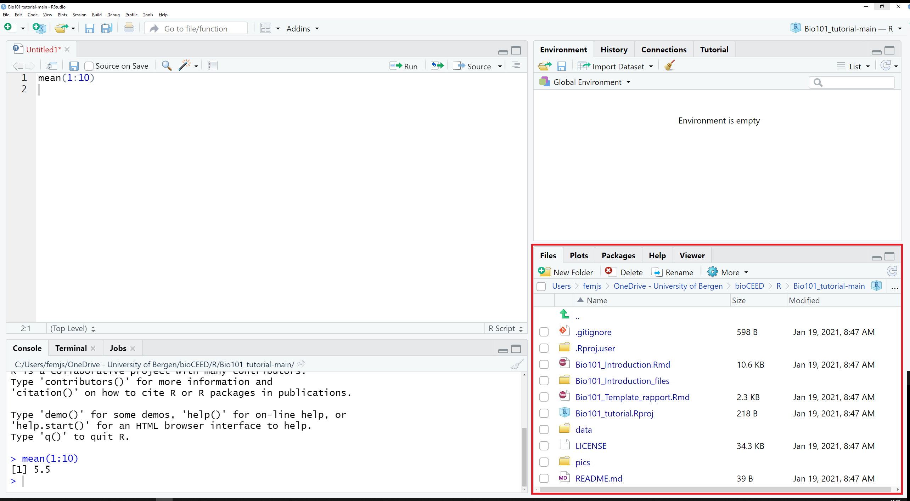
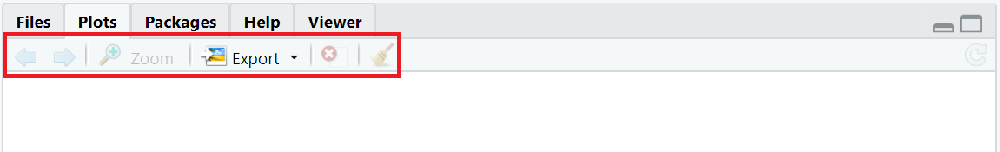

```{r setup, include=FALSE}
knitr::opts_chunk$set(echo = TRUE, warning = FALSE)
library("tidyverse")
library("ggplot2")
library("broom")
```
```{r setup, include=FALSE}
knitr::opts_chunk$set(echo = TRUE)
```

# Intro

Hei

Vi på [bioST@TS](https://biostats.w.uib.no/){target="_blank"} har utviklet denne siden for å hjelpe deg med å komme i gang med R og å løse numeriske oppgaver i mikrobiologi labkurset i BIO101. 

Som en del av BIO101 skal du lære å behandle en enkel data sett, å lage en tabell og å tegne en plot basert på ekte data samlet i forrige labkurs. 
Dette skal utføres i R/RStudio.
[R](https://cran.r-project.org/){target="_blank"} er både et programmeringsspråk og en programvare for statistiske beregninger og grafikk. 
R kommer med sin egen minimalistisk grensesnitt, men vi anbefaler at du bruker en annen programvare som heter [RStudio](https://rstudio.com){target="_blank"} og som gjør jobben i R mye lettere.

NB: RStudio brukes _i kombinasjon med R_, ikke istedenfor R. 
Derfor kommer du til å installere begge på din maskin. RStudio tar over R sitt grensesnitt, men alle beregninger utføres av R "i bakgrunnen". 
Dette forklarer hvorfor du skal ofte lese "R/RStudio" i våre sider.


## Hvorfor jobber vi i R/RStudio?

Det finnes mange fordeler med å ta R/RStudio i bruk. 
Først og fremst er programvaren _fri_ og _open-source_, og kan installeres den på de fleste maskinene (Windows, Mac, Linux, osv).
R kan brukes for å utføre veldig enkle numeriske oppgaver (for eksempel kan R brukes som en helt vanlig kalkulator og regne ut `2+2`, `(2+3)*4`, logaritme (`log(42)`), eller kvadratrot (`sqrt(42)`), samt veldig avanserte statistiske analyser (f. eks. for å bygge data modeller basert på millioner av observasjoner).  
R er i konstant utvikling; det kan nedlastes oppgraderinger (som kalles for "packages") som utvider funksjonalitetene.
R brukes av mange i akademia, og spesielt i biologi. 
Dermed finnes det garantert noen i nærheten av deg som kan hjelpe til når du er i trøbbel.
De oraklene på [biORAKEL](https://biorakel.w.uib.no){target="_blank"} og [codeRclub](https://codeRclub.w.uib.no){target="_blank"} er kjent med R/RStudio og tilbyr deg hjelp når du trenger det.  

Merk at det er ikke bare BIO101 som tar i bruk R/RStudio. 
Flere emner i bachelorprogrammet (og i masterprogammet) bruker det òg, f. eks. BIO102, STAT101 og BIO201. 
Dermed er det lurt å bli kjent med R så fort som mulig.


# Hvordan installere R og RStudio

Som UiB student får du tilgang til mange programvarer via [UiB Tredjepartsportalen](apps.uib.no).
Både R og RStudio er tilgjengelige i Tredjepartsportalen.
Informasjon om hvordan du får tilgang til portalen finner du [her på Mitt UiB](https://mitt.uib.no/courses/22090).

Alternativt kan man nedlaste R direkte fra nettsiden til [The Comprehensive R Archive Network](https://cloud.r-project.org/) og RStudio fra [RStudio sin nettside](https://rstudio.com/products/rstudio/download/#download). 
Pass på at du velger den versjonen som passer din maskin.

# Kom i gang med RStudio

Når du åpner RStudio for første gang, får du se dette grensesnittet (Figur \@ref(fig:rstudio-start)):
```{r rstudio-start, echo = FALSE, fig.cap="_RStudio grensesnittet_", out.width="100%"}

```

Grensesnittet deles i 3 områder:

+ et stort område til venstre der man finner de fanene **`Console`**, `Terminal` og `Jobs`, 
+ et mindre område opp til høyre med de fanene `Environment`, `History`, `Connections` and `Tutorial`, 
+ et siste område ned til høyre med de fanene **`Files`**, **`Plots`**, `Packages`, `Help` and `Viewer`. 

I denne øvelsen skal vi fokusere på de fanene skrevet i fet skrift, nemlig **`Files`**, **`Plots`** og **`Console`**.
Disse skal beskrives senere.

## Skript

Hvis du trykker nå på `CTRL + Shift + N` (`⌘ + Shift + N`), så dukker det opp et nytt område opp til venstre. Dette område er et skript. 
Den heter `Untitled1` og er helt blank (se Figur \@ref(fig:rstudio-gui2)).
Et skript er et ren tekst fil der du skal skrive, lagre og redigere din kode.

```{r rstudio-gui2, echo = FALSE, fig.cap="_The script_ Untitled1 _shows up in the top left pane._", out.width="100%"}

```

Et skript er en notisblokk der du skriver akkurat hva du vil.
R skal ikke utføre noe som helst før du ber den om det.
Du kan for eksempel skrive den følgende koden som regner ut gjennomsnittet av tallene fra 1 til 10 ved bruk av funksjonen `mean()`.
`1:10 er et uttryk som betyr "alle de tallene fra og med 1 til og med 10". 

```{r script, echo=TRUE, eval=FALSE, fig.cap="_Et enkelt skript_"}
# Regne gjennomsnittet av 1:10
mean(1:10)
```

Også skriver man  
Du ser også at den første linjen begynner på `#`. 
Det betyr at alt som står på den samme linjen er et kommentar som skal ikke behandle av R. 
Man bruker kommentarer for å annotere koden slik at man husker alltid hva man mener å kode for.
Når koden består av hundrevis av linjer, er det ganske lurt å bruke kommentarer. 

Når du har skrevet kode og er klar til å utføre den, så trykker du på `CTRL + ALT + Enter` (`⌘ + ⌥ +  Enter`)  for å sende HELE koden til konsolen.
Alternativt klikker du på én av linjene og bruker `CTRL + Enter` (`⌘ + Enter`) for å utføre bare denne linjen. 


## Konsole

Den fanen `Console` befinnes nederst til venstre i RStudio (see Figur \@ref(fig:rstudio-gui3)).

```{r rstudio-gui3, echo = FALSE, fig.cap="_Den fanen_ Console _", out.width="100%"}

```

Konsolen er "motoren i R".
Det er konsolen som utfører koden som du har nettopp sendt ut fra skriptet.


# Opprett et prosjekt til denne øvelsen

R/RStudio gjør det lett for deg å organisere filene dine ved å opprette prosjekter.
Hvert prosjekt har egen mappe og egne instillinger.
Det gjør det lettere å ikke blande data filer og å ikke bomme på noe på grunn av uryddighet.  

Her skal vi opprette et prosjekt til den øvelsen i BIO101.
I menyen øverst i Rstudio, gå til File > New Project... (se Figur \@ref(fig:new-project)):
```{r new-project, echo = FALSE, fig.cap="_Opprette et prosjekt -- steg 1_", out.width="100%"}
knitr::include_graphics("Pics/RStudio-newproject.png")
```

Klikk på New Directory > New Project, oppgi prosjektnavn (f. eks. "BIO101-mikrobiologi"), velg en mappe der prosjektet skal lagres, og klikk på "Create Project" (se Figur \@ref(fig:new-project2)):

```{r new-project2, echo = FALSE, fig.cap="_Opprette et prosjekt -- steg 2_", out.width="100%"}
knitr::include_graphics("Pics/RStudio-createproject.png")
```

I denne mappen kan du nå importere de(n) filen(e) som du trenger til øvelsen.
I fanen `Files` (ned til høyre i RStudio), klikk på More > Show Folder in New Window (se Figur \@ref(rstudio-gui7)). Dette åpner et nytt vindu der du kan legge til den filen med dataene fra BIO101 labøvelsen. 

```{r rstudio-gui7, echo = FALSE, fig.cap="_Menyen i fanen_ Files", out.width="100%"}

```


Feel free to import in the project folder all the files that you will need later on, such as original data sets, etc. 
You may also install and activate all the necessary packages at once. 
Again, we recommend that you install at least the tidyverse:

```{r recommended-tidyverse2, echo=TRUE, eval=FALSE}
install.packages("tidyverse")
library(tidyverse)
``` 


You may open several scripts at the same time. 
Each of them will show up as a separate tab in the top left pane of RStudio.
If the tab title is red and followed with a star `*`, this means that the script is not yet saved, or has been edited since the last time it was saved.
Scripts may be saved at any time using `CTRL + S` (or ⌘ + S).

In section \@ref(working-with-a-script), we will talk more about working with scripts and adding comments.


## Files, Plots

The tabs `Files`, `Plots` and `Packages` are located in the bottom right pane, along with `Help` and `Viewer` (see Figure \@ref(fig:rstudio-gui6)).

```{r rstudio-gui6, echo = FALSE, fig.cap="_The tab_ Files, Plots _and_ Packages _are located in the bottom right pane._", out.width="100%"}

```

### The tab Files 

The tab `Files` is a file explorer that lets you navigate the folder structure of your project (for more info about projects, see \@ref(working-with-a-project)).

When RStudio starts up in a given project, the tab `Files` displays by default the content of the project folder.
For a new project, the only content should be able to see is a single .Rproj file.  
NB: We will see in section \@ref(working-with-a-project) what the benefits to work with a project are.  
This is also the folder where the scripts that you create are preferentially saved and stored. 
Feel free to add subfolders, data files and anything else that will be relevant for your work.  

At the top of the pane, you will find the following menu:
```{r rstudio-gui7, echo = FALSE, fig.cap="_The menu in the tab_ Files", out.width="100%"}

```

Via this menu, you can rename and/or delete the files you have checked in the list beforehand; you can also create new folders, and copy or move items to other places via the dropdown menu of the button `More`.


### The tab Plots 

The tab `Plots` is the place where graphic outputs that result from your code will be displayed.

Whenever a code chunk leading to a plot is run in the console, the corresponding plot appears in that tab and its size will adapt automatically to the size of the pane.
When changing the dimensions of the pane, plots will be automatically refreshed to fit the new frame.

At the top of the pane, you will find the following menu:
```{r rstudio-gui9, echo = FALSE, fig.cap="_The menu in the tab_ Plots", out.width="100%"}

```

Via this menu, you can explore all the plots that have been created (not only the latest one) with the arrows, zoom in and out, delete the current plot or all the plots.
The button `Export` offers two options to save the currently displayed plot as a file. 
You may either `save as image` or `save as pdf`. 
In both cases, a dialog box pops up that lets you define the dimensions, target folder, file name, file type, etc. 


# Installing packages

Packages are add-ons to base R (the R base package) that expand the computing possibilities of R by adding new functions, classes, documentation, data sets, etc.
When installing RStudio for the first time, a long list of packages comes along. 
You will find this list in the tab `Packages` (see section \@ref(the-tab-packages)).

This section will show you how to install additional packages.
Every time you install a new one, R imports all necessary files into a local *library*, but does not activate it.
You will have to remember to activate the new package with `library()` every time your project require items or functions from that package. 

## Packages published on CRAN

If you want to install a package published on [CRAN](https://cran.r-project.org/){target="_blank"} repository, you may use the function `install.packages()`.
Simply type its name and add quotation marks `"` `"`.
Here is an example with the package `tidyr`:
```{r install-packages, echo = TRUE, eval=FALSE}
install.packages("tidyr")
```

You may use the exact same code to update the package later on.  

If you want to update all packages at once, use the following code:
```{r update-packages, echo = TRUE, eval=FALSE}
update.packages()
```

## Packages published on GitHub

If you want to install a package published on [GitHub](https://github.com/){target="_blank"}, you may use the function `remotes::install_github()`.
Type first the name of the repository, then `\` and the name of the package.
Here also, you must add quotation marks `"` `"`.
Here is an example with the package `biostats.tutorials`, located  in the repo `biostats-r`:
```{r install-github, echo=TRUE, eval=FALSE}
remotes::install_github("biostats-r/biostats.tutorials")
```
