```{r setup, include=FALSE}
knitr::opts_chunk$set(echo = TRUE, warning = FALSE)
library("tidyverse")
```

#   {- .toc-ignore}

Hei, 

Velkommen til den første numeriske øvelsen i BIO101 - Organismbiologi.
Som en del av labkurset i BIO101 skal du få levert et enkelt data sett som består av reelle observasjoner hentet fra fjorårets labkurs i mikrobiologi. 
Dette data settet skal du bruke for å lære deg å:

+ behandle ekte data, 
+ utføre enkle statistiske beregninger,
+ lage en tabell,
+ tegne en plot,
+ sette alt sammen til en fullstending rapport.

Øvelsen skal utføres i R/RStudio. Vi på [bioST@TS](https://biostats.w.uib.no/){target="_blank"} har utviklet denne siden for å hjelpe deg med å komme i gang med R/RStudio og å løse de numeriske oppgavene i denne øvelsen. 


# Kom i gang med R/RStudio

## Litt om R

[R](https://cran.r-project.org/){target="_blank"} er både et programmeringsspråk og en programvare for statistiske beregninger og grafikk. 
R er et kraftig og fleksibelt verktøy som gjør jobben med data analyse enkelt og produktivt.

I motsetning til de fleste programvarene som du kjenner bruker R/RStudio kommandoer for å utføre oppgaver. 
Det betyr at du skal skrive kode for å håndtere data og for å lage tabeller og plotter.

Ved hjelp av denne siden skal du lære å bruke språket R for å skrive enkle "setninger" som transformere data til tabeller og figurer som skal brukes i din rapport.

## Et alternativt grensesnitt

R kommer med sitt eget grafiske grensesnitt som gjenkjennes som minimalistisk, med begrenset funksjonalitet, få knapper og få menyer.
Dermed installerer de fleste en alternativt grensesnitt som fortsatt kjører R, men som virker mer produktivt og brukervennlig.
Det finnes flere sånne programvarer.
Den som vi anbefaler og viser til heter [RStudio](https://rstudio.com){target="_blank"}.  

Merk at RStudio brukes _i kombinasjon med R_, ikke istedenfor R. 
Derfor kommer du til å installere begge på din maskin (se seksjon \@ref(installer-r-og-rstudio)). 
RStudio tar over R sitt grensesnitt, men alle beregninger utføres av R "i bakgrunnen". 
Dette forklarer hvorfor du skal ofte lese "R/RStudio" på denne siden.


## Hvorfor jobber vi i R/RStudio?

Det finnes mange fordeler med å ta R/RStudio i bruk:

+ Først og fremst er R _fri_ og _open-source_, og kan installeres den på de fleste maskinene (Windows, Mac, Linux, osv).
+ R kan utføre veldig enkle numeriske oppgaver (for eksempel kan R brukes som en helt vanlig kalkulator og regne ut `2+2`, `(2+3)*4`, logaritme (`log(42)`), eller kvadratrot (`sqrt(42)`), samt veldig avanserte statistiske analyser (f. eks. for å bygge data modeller basert på millioner av observasjoner).  
+ R er i konstant utvikling; det kan nedlastes utvidelser (som kalles for "R-pakker" eller "R-packages") som utvider funksjonalitetene.
+ R brukes av mange i akademia, og spesielt i biologi. 
Dermed finnes det garantert noen i nærheten av deg som kan hjelpe til når du er i trøbbel. 
+ Fordi R brukes av mange i hele verden og i mange discipliner, finnes det et stort sammfunn online som kan hjelpe deg (det forumet [Stack Overflow](https://stackoverflow.com/){target="_blank"} er godt kjent blant R-brukere)

## R/RStudio i biologiemner

Det er ikke bare BIO101 som tar bruk av R/RStudio. 
Flere emner i bachelorprogrammet (og i masterprogrammet) bruker det òg, f. eks. BIO102, STAT101 og BIO201. 
Derfor er det lurt å bli kjent med R så fort som mulig.

## Få hjelp med R/RStudio

Det finnes mange steder der du kan finne hjelp og informasjon om R/RStudio:

+ vår nettside [bioST@TS](https://biostats.w.uib.no/up-in-the-r-2/) har en dedikert seksjon hvor du skal lære mye om både R/RStudio og statistikk.
+ de oraklene på [biORAKEL](https://biorakel.w.uib.no){target="_blank"} er kjent med R/RStudio og tilbyr deg hjelp når du trenger det.  
+ [codeRclub](https://codeRclub.w.uib.no){target="_blank"} er et møtested for de som lærer eller jobber med R/RStudio.
Alle er velkommen og kan søke hjelp hos oss. 
Vi møtes på fredager fra kl.14:00 til 16:00 på Tunet (4. etasje på biologen, bygg A, Thormøhlensgate 53A, UiB) og på Zoom (ta kontakt med [Richard Telford](mailto:richard.telford@uib.no) for å få lenken). 
Kom på besøk om du er i trøbbel eller lurer på noe.
+ på nettet finner du mange fora der du får løsning på problemene dine. 
Ofte er det "bare" å google.
Mange spørsmål stilles på [Stack Overflow](https://stackoverflow.com/questions/tagged/r){target="_blank"}, og mange gode svar finnes der òg.
 

## Installer R og RStudio

Som UiB student får du tilgang til mange programvarer via [UiB Tredjepartsportalen](apps.uib.no).
Der finner du både R og RStudio.
Informasjon om hvordan du får tilgang til portalen finner du [her på Mitt UiB](https://mitt.uib.no/courses/22090).
Søk etter de programvarene og installer dem på din maskin.  

Alternativt kan du nedlaste R direkte fra nettsiden til [The Comprehensive R Archive Network](https://cloud.r-project.org/) og RStudio fra [RStudio sin nettside](https://rstudio.com/products/rstudio/download/#download). 
Pass på at du velger den versjonen som passer din maskin.

# Kom i gang med øvelsen

Nå er det på tid å starte jobben. 
Først skal du hente de filene som vi skal jobbe med.
Deretter skal vi åpne "prosjektet", bli kjent med grensesnittet til RStudio og lær koding i R.


## Last ned filene

La oss først installere alle de filene som du trenger til øvelsen.
Klikk på [denne lenken](https://github.com/biostats-r/Bio101_tutorial/archive/main.zip){target="_blank"} for å nedlaste filen `Bio101_tutorial-main.zip`.
Åpne denne filen og ekstraher den hele mappen på harddisken din.
Velg et lurt sted, f.eks `.\Mine dokumenter\BIO101\` eller lignende.


## Første steg i RStudio

Mest av tiden kommer du til å starte R/RStudio ved å åpne et prosjekt.
Et prosjekt består av en mappe som inneholder en .Rproj-fil og eventuelt andre filer (data filer, skript, osv).
I denne øvelsen heter filen `Bio101_tutorial.Rproj`.
Når du dobbelklikker på filen, så åpnes den direkte i RStudio.
Da får du se dette grensesnittet (Figur \@ref(fig:rstudio-start)):
```{r rstudio-start, echo = FALSE, fig.cap="_Skjermdump av RStudio sitt grensesnitt_", out.width="100%"}
knitr::include_graphics("Pics/RStudio-start.png")
```
  
Øverst i vinduet finner du også en meny med mange funksjoner:  

```{r rstudio-meny, echo = FALSE, fig.cap="_Skjermdump av hovedmenyen i RStudio_", out.width="100%"}
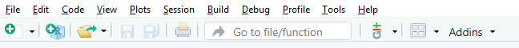
```
  
Via denne menyen skal du kunne bl. a. lage ny fil, åpne eksisterende filer eller prosjekt, lagre endringer i filer, osv.  

Grensesnittet (se Figur \@ref(fig:rstudio-start)) deles i 3 områder:

+ et stort område til venstre der man finner de fanene **`Console`**, `Terminal` og `Jobs`, 
+ et mindre område opp til høyre med de fanene `Environment`, `History`, `Connections` and `Tutorial`, 
+ et siste område ned til høyre med de fanene **`Files`**, `Plots`, `Packages`, `Help` and `Viewer`.  

Her skal vi fokusere på de fanene skrevet i fet skrift, nemlig **`Files`** (se seksjon \@ref(files)) og **`Console`** (se seksjon \@ref(console)).
Dessuten skal vi ta bruk av skript (se seksjon \@ref(skript)).


### Skript

Et skript er et arbeidsdokument der du skriver kode, kommentarer og tekst.
Du kan starte jobben iR/RStudio med et blankt skript, eller åpne et forhåndsfylt skript.
I denne øvelsen skal vi jobbe i en forhåndsfylt fil som heter `Bio101_Template_rapport.Rmd`. 
Vi kommer tilbake til det senere i seksjonen \@ref(skriv-din-rapport).  

Hvis du ønsker å opprett et nytt skript for å jobbe med noe annet eller trene på koding, så trykker du på `CTRL + Shift + N` (`⌘ + Shift + N`), eller velger File > New File > R Script i menyen øverst. 
Da dukker det opp et nytt ark opp til venstre. Dette arket heter `Untitled1` og er helt blankt (se Figur \@ref(fig:rstudio-script)).

```{r rstudio-script, echo = FALSE, fig.cap="_Opprette et nytt skript._", out.width="100%"}
knitr::include_graphics("Pics/RStudio-script.png")
```


Et skript er like en notisblokk der du skriver akkurat det du vil uten at R/RStudio skal utføre noe som helst før du ber den gjøre det.  

Du kan for eksempel skrive den følgende koden i skriptet ditt:
```{r script, echo=TRUE, eval=FALSE}
mean(1:10)
```

Denne enkle koden regner gjennomsnittet av tallene fra 1 til 10.
Det forklares på denne måten:

+ `1:10` er et uttryk som betyr "alle de tallene fra og med 1 til og med 10", 
+ `mean( )` er en funskjon som ber R regne ut gjennomsnittet av alt som finnes mellom parentesene `(` `)`.

Når du har skrevet koden i skriptet og er klar til å utføre den, så trykker du på knappen `Run` (se Figur \@ref(fig:rstudio-run)) for å sende koden til konsolen. Alternativt kan du trykke `CTRL + ALT + Enter` (`⌘ + ⌥ +  Enter`)  for å sende hele koden til konsolen.

```{r rstudio-run, echo = FALSE, fig.cap="_Utfør koden med knappen_ Run", out.width="100%"}
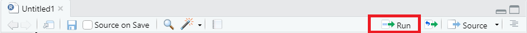
```

### Console

Den fanen `Console` finnes du nederst til venstre i RStudio.
Konsolen er "motoren i R".
Det er konsolen som utfører koden som du har nettopp sendt ut fra skriptet.

Figur \@ref(fig:rstudio-gui2) viser skriptet (rød boks) og det tilsvarende resultatet i konsolen (grønn boks):

```{r rstudio-gui2, echo = FALSE, fig.cap="_Koden i skriptet utføres i konsolen_", out.width="100%"}
knitr::include_graphics("Pics/RStudio-console.png")
```


Koden vises i blått på en linje som starter på `>`.
Derimot skrives resultatet av `means(1:10)` i svart på en linje som starter på `[1]`.
Resultatet er `r mean(1:10)`.  

#### Installere R-pakker via konsolen

R-pakker (altså "packages") er utvidelser som legger til funksjoner og funksjonaliteter i R.
Noen pakker legger til muligheten til å rydde data sett, noen lar deg tegne fine plotter, osv.

I den øvelsen trenger vi pakken `tidyverse`. 
`tidyverse` installeres via konsolen ved hjelp av funksjonen `install.packages()`. Kopiér og lim inn den følgende linjen direkte i konsolen, og trykk `Enter`:
```{r install-packages, echo = TRUE, eval=FALSE}
install.packages("tidyverse")
```

`install.packages()` tar seg av å nedlaste og installere pakker i R/RStudio.
Dessuten bruker du funksjonen `library()` for å aktivere de installerte pakkene nå de trenges.
Da kan du kopiere og lime inn denne koden i konsolen:
```{r activate-packages, echo = TRUE, eval=FALSE}
library(tidyverse)
```


### Files

Den fanen `Files` finner du nederst til høyre i RStudio (se Figur \@ref(fig:rstudio-gui6)).
`Files` er en filutforsker som viser deg innholdet på prosjektmappen.
Her skal du finne filene `Bio101_tutorial.Rproj` og `Bio101_Template_rapport.Rmd` som vi skal snart ta i bruk.

```{r rstudio-gui6, echo = FALSE, fig.cap="_Den fanen_ Files _ er filutforskeren i RStudio._", out.width="100%"}
knitr::include_graphics("Pics/RStudio-files.png")
```


Hvis du ønsker å lagre ditt arbeid (f.eks. skriptet ditt eller en forhåndfylt fil som du har redigert), så går du tilbake til fanen `Untitled1` og trykker `CTRL + S` (`⌘ + S`). 
Som standard lagres nyopprettede filer i den prosjektmappen.

Hvis du ønsker å importere filer i den mappen, så klikker du på More > Show Folder in New Window i menyen til `Files` (se Figur \@ref(fig:rstudio-gui3)). Et nytt vindu åpnes som lar deg velge filer som skal importeres.
```{r rstudio-gui3, echo = FALSE, fig.cap="_Skermdump av menyen i fanen_ Files", out.width="100%"}
knitr::include_graphics("Pics/RStudio-files-menu.png")
```


 

# Lær å kode i R

I prosjektmappen til denne øvelsen finner du den filen `Bio101-Introduction.Rmd`.
Klikk på den i den fanen `Files`.
Filen åpnes direkte i en ny fane opp til venstre.
I menyen øverst i fanen, klikk på `Run Document` (se Figur \@ref(fig:rstudio-run-intro)).

```{r rstudio-run-intro, echo = FALSE, fig.cap="_Start appen ved å trykke på_ Run document.", out.width="100%"}
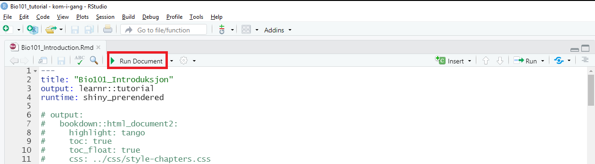
```

Etter noen sekunder dukker det opp et nytt vindu med en app (se Figur \@ref(fig:rstudio-app)).
Appen inneholder bakgrunnsinformasjon om alt du bør vite for å lage figurene i rapporten. 
Du skal lese og lære om datasettet, gjennomsnitt og variabilitet, koden som lar deg regne dem, koden som lar deg lage tabeller, tegne plot, osv.  

Appen ser sånn ut:
```{r rstudio-app, echo = FALSE, fig.cap="_Skjermdump av appen._", out.width="100%"}
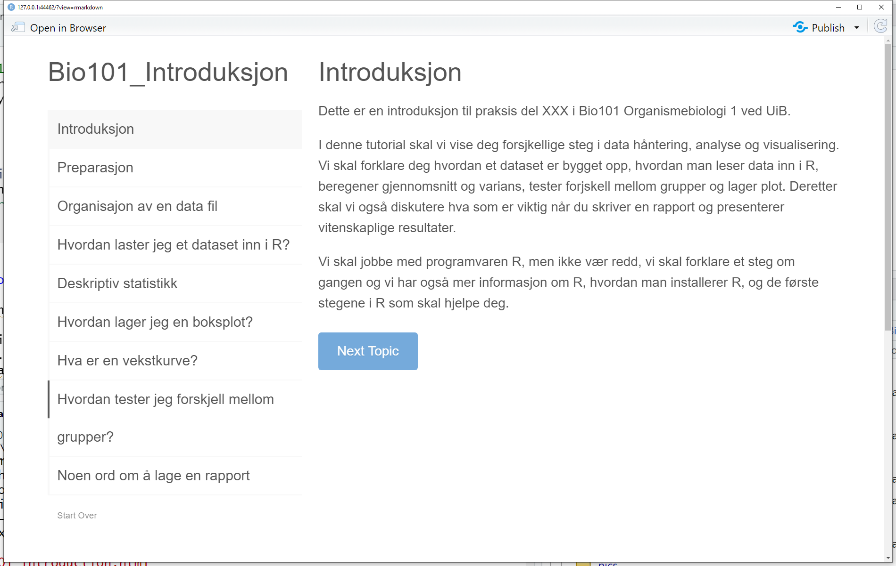
```


Den appen inneholder flere interaktive vinduer der du kan prøve koden selv, redigere og utføre den.
Slike vinduer ser sånn ut:

```{r rstudio-learnr, echo = FALSE, fig.cap="_Et interaktivt vindu i appen_", out.width="100%"}
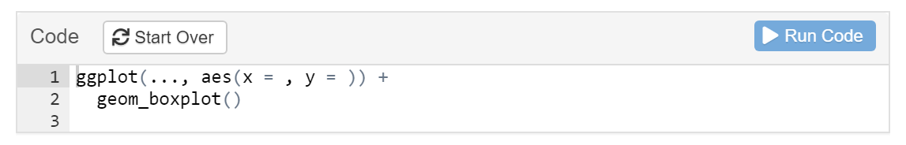
```

Disse vinduene er forhåndsfylt med ufullstendig kode.
Her kan du redigere koden, legge til data, og utføre den ved å trykke på knappen `Run code`.
Resultatet vises med én gang. 
Er du ikke fornøyd med resultatet eller mangler det noe, så kan du redigere koden (eller begynne på nytt ved bruk av knappen `Start Over`) og utføre den på nytt.

Hver gang du klarer å lage en figur, så kan den tilsvarende koden kopieres inn i rapporten (se seksjon \@ref(skriv-din-rapport)).
Og når du er ferdig med appen, så har du alt du trenger for å lage figurene.  

# Skriv din rapport

Nå kan du åpne malen for rapporten.
Det gjør du ved å trykke på filen `Bio101_Template_rapport.Rmd` i fanen `Files`.

Malen ser sånn ut:

```{r rstudio-Template, echo = FALSE, fig.cap="_Skjermdump av malen til rapporten_", out.width="100%"}
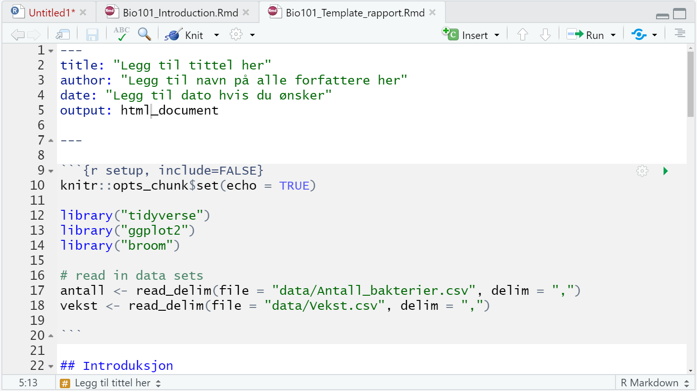
```

Denne filen er skrevet i `Rmarkdown`-formatt som gjør redigeringsprossessen pålitelig.
Ved bruk av knappen `knitr` (se den røde boksen i Figur \@ref(fig:rstudio-knitr)), produserer `Rmarkdown` et ferdigformattert dokument med figurer, titler og tekst.

```{r rstudio-knitr, echo = FALSE, fig.cap="_Den knappen_ knitr _skriver ut rapporten basert på innholdet i_ Rmarkdown _-filen._", out.width="100%"}
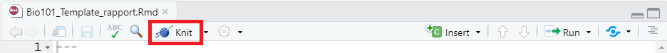
```

Hvis du trykker allerede nå på `knitr`, så får du dette dokumentet:

```{r rstudio-knitr-ferdig, echo = FALSE, fig.cap="_Skjermdump av rapporten produsert av knitr._", out.width="100%"}
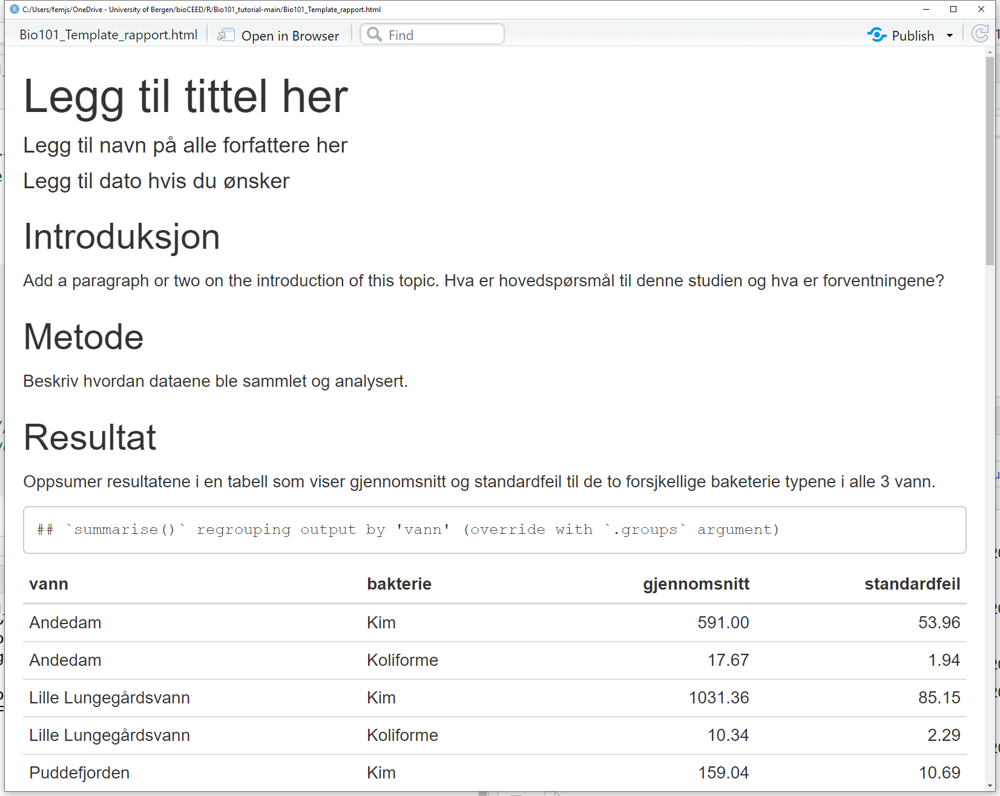
```


## Topptekst

Øverst i malen finner du et området som både starter og slutter på ` --- ` (se Figur \@ref(fig:rstudio-Template-topp)).
Dette er toppteksten som skal vise titlen, forfattere og dato øverst i rapporten.
```{r rstudio-Template-topp, echo = FALSE, fig.cap="_Her skal du rediger toppteksten_", out.width="100%"}
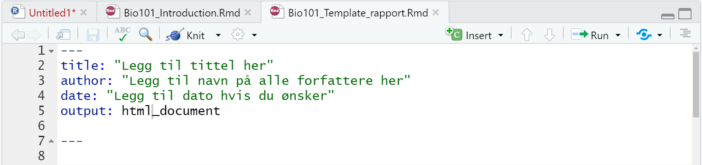
```
Der skal du legge til titlen, forfatternavn og datoen. 
Husk å ikke fjerne `" "`. 
Den siste linjen med `output: html_document` må du la stå uendret.

## Titler og tekst

I Rmarkdown vises titler i blått skrift og starter på `##` (se eksempel i Figur \@ref(fig:rstudio-titler)).
Disse skal ikke redigeres!  
Derimot skal du legge til teksten i de fire forskjellige avsnittene `Introduksjon`, `Metode`, `Resultat` og `Diskusjon`.
Merk at teksten vises i svart i malen.  

```{r rstudio-titler, echo = FALSE, fig.cap="_Her skal du legge til teksten, men ikke redigere titlen._", out.width="100%"}
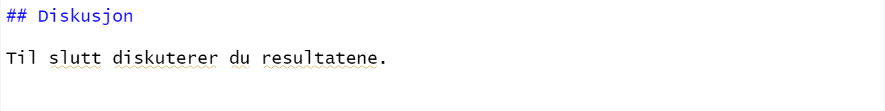
```


NB: du skal skrive rapporten ved å bruke **IMRoD-strukturen**. 
Om du trenger hjelp med skriving, så kan du sjekke ut [denne bioSKRIV  siden](https://bioskriv.w.uib.no/struktur-imrod/){target="_blank"}.
De oraklene på [biORAKEL](https://biorakel.w.uib.no){target="_blank"} kan også hjelpe deg.

## Code chunks

"Code chunks" (eller "chunks") er disse grå områdene i malen som starter med ` ```{r } ` og slutter med ` ``` `. 
Chunks brukes til å utføre koden som skal produsere figurene (tabell, plot, osv).
Hver chunk fører til én figur.  
Her er et eksempel:

```{r rstudio-chunk, echo = FALSE, fig.cap="_Eksempel på en code chunk_", out.width="100%"}
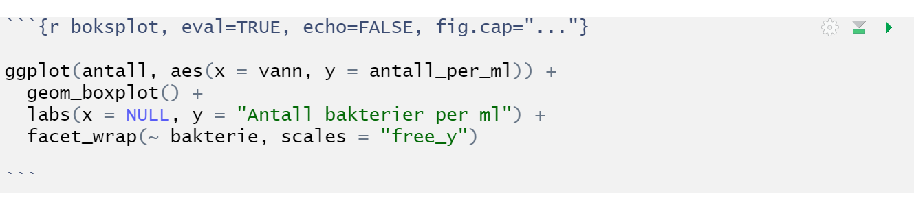
```


På den første linjen med ` ```{r } ` finner du argumentet `fig.cap="..."`.
Her skal du erstatte `...` med figurteksten.
Er du usikker på hvordan du skal skrive figurtekst, sjekk [denne siden](https://biostats.w.uib.no/hvordan-skrive-figurtekst/){target="_blank"}.  

Resten av koden som du har lært og utarbeidet i appen skal legges til på de neste linjene.


NB: Husk å ikke fjerne ` ``` `!

I utgangspunktet skal du produsere tre figurer: 

+ en tabell som viser gjennomsnitt og standardfeil til de to forskjellige bakterie typene i alle 3 vann,
+ en boksplot som viser antall bakterier per vann og bakterie type,
+ en vekstkurve.


## Skriv ut rapporten med knitr

Når din rapport er klar, så er det bare å trykke på knappen `knitr`.
Hvis alt er korrekt, så åpnes rapporten i et nytt vindu.
Finner du noe feil, så kan du gå tilbake til malen og endre det.  

Liker du din rapport akkurat som den er, så trykker du på `Open in Browser` øverst i vinduet. 
Rapporten åpnes da i nettleseren din.
Trykk på `CTRL + P` (`⌘ + P`)  for å skrive ut rapporten.
Den er klar til levering med resten av din lab journal.  

Gratulerer med din første rapport i R/RStudio!


